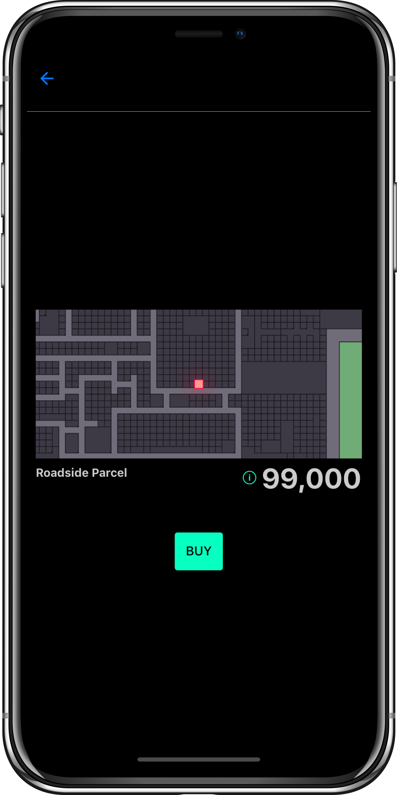

# Tasit

[](https://circleci.com/gh/tasitlabs/tasit)
[](https://greenkeeper.io/)

<div align="left">
  
</div>

## What is Tasit?

Tasit is a suite of native mobile apps for mainstream users that lets them use popular Ethereum dapps as easily as their other favorite apps (e.g. Instagram, Facebook, Gmail, etc.) - without needing to know the technical detail that Ethereum is involved.

Unlike with Status, Coinbase Wallet, Cipher, or other dapp browsers where you use multiple dapps as mobile web apps from within one app, you can use each of the Tasit dapps via its own standalone native mobile app.

This entails a different, simpler onboarding flow in an environment without MetaMask. The user is in control of their private keys, but much of this happens "automagically" behind the scenes.

Development of the Tasit apps is supported in part by [Gnosis](https://github.com/gnosis/) through their [GECO](https://github.com/gnosis/GECO) grant initiative.

This project is open-source and in need of additional funding to sustain work on it. If you're able to contribute, please consider [supporting the project on Gitcoin Grants](https://gitcoin.co/grants/183/tasit-native-mobile-ethereum-dapps) or sending ETH or DAI to the Tasit project's contract address:

`0x7d888a9036b5a96f77b433e65b9be1b122f8a499` ([Etherscan](https://etherscan.io/address/0x7d888a9036b5a96f77b433e65b9be1b122f8a499))

The Tasit apps are built with [the Tasit SDK](https://github.com/tasitlabs/TasitSDK), a JavaScript SDK that empowers developers to create their own native Ethereum dapps.

_Disclaimer:_ The alpha versions of these apps are under active development. We encourage you to try them out today for hackathons, etc., but they're not ready for anything involving real funds on mainnet. If you'd prefer to wait for a more battle-tested release, please watch this repo with the `Releases only` setting and/or sign up to be notified about our releases on the [tasit.io](https://tasit.io) website.

##### A bit skeptical about the need for mobile dapps?

You might want to jump ahead to the "why" section to start:

- [Why are native dapps important?](#why-are-native-dapps-important)

## Tasit apps

### Simple onboarding

<div align="left">
  
  
  
</div>

### Decentraland by Tasit

Our first production app is called `Decentraland by Tasit`. [Decentraland](https://decentraland.org/) is a dapp using [unique tokens / NFTs](http://erc721.org/). `Decentraland by Tasit` lets you use that dapp on mobile.

This is the first Tasit app - we plan to release one or two other similar 3rd-party apps for other popular Ethereum projects. This app also shows off the major functionality of the [Tasit SDK](https://github.com/tasitlabs/TasitSDK).

We're building the "Decentraland by Tasit" app in the [`decentraland` dir](./decentraland). Soon we'll move the minimal feature set over [to the `demo` folder](./demo) and the shared components to the [`shared` dir](./shared).

<div align="left">
  
  
  
</div>

### Tasit demo app

The Tasit demo app shows off how easy it is to build a standalone native mobile app for Ethereum using the [Tasit SDK](https://github.com/tasitlabs/TasitSDK).

The app is built using React Native, Expo, [React Navigation](https://reactnavigation.org/), Prettier, Babel, and the Tasit SDK.

For now the [Decentraland by Tasit](./decentraland) app temporarily also is serving as the "demo" app. Soon we'll duplicate just the minimal set of features from this app over in the [`demo`](./demo) dir and extract the generic parts into the `shared` dir and import them in each app.

##### Features

> - Ephemeral account and private key generation
> - Uses a simple ERC721 abstraction from the Tasit SDK for reading and writing data and reacting to events
> - A working demo of onboarding with a few things still hardcoded for users who already have funds stored
> - A working demo of onboarding for users new to Ethereum
> - Minimal proof-of-concept app ready to ship to TestFlight for iOS using a testnet

## Other Tasit apps coming soon

### Aragon by Tasit

([DAOs](https://blog.aragon.org/bringing-daos-back-aragon-monthly-92756cb65639/))

### The road ahead

In the long run, Tasit will stitch together components from multiple dapps into novel experiences, like delegating your vote for a particular TCR to a preexisting Aragon organization, or decorating your Dharma loans with the same hats you use for your CryptoKitties because...reasons? We'll likely build apps in the future for lists (TCRs) and marketplaces.

## Developers

This is a monorepo for all of the open-source Tasit 3rd-party mobile apps for Ethereum dapps.

These apps all use the [Tasit SDK](https://github.com/tasitlabs/TasitSDK).

For more info, please visit our website:

[tasit.io](https://tasit.io/)

### Getting started

```
git clone https://github.com/tasitlabs/tasit.git
cd tasit
cd demo
npm install
npm start
```

### Automatic scaffolding using the Tasit CLI

Are you starting a project from scratch? Let the Tasit CLI scaffold out your project for you.

Just run:

```
npm install tasit-cli
npx tasit init my-app
cd my-app
npm start
```

...to automatically generate the scaffolding for a mobile dapp project.

Alternatively, for popular ERC standards like ERC-721 for NFTs, you can even run:

```
npx tasit init my-app --nft
```

...to instantly create a standalone mobile dapp for CryptoKitties, Decentraland, etc.

This app scaffold comes ready to submit for beta testing on iOS with Testflight and on Android with Google Play Beta track, so you can focus on the core features of your dapp like you would do on the web.

We're building the Tasit CLI in the [`cli` dir](./cli). It's still a work in progress.

## Why are native dapps important?

A major obstacle preventing the mainstream adoption of dapps is the clunky and confusing UX of today's dapps - typically happening within a mobile dapp browser (more on that [here](https://github.com/tasitlabs/TasitSDK#why-from-the-users-perspective)).

The focus for the Tasit products is on providing simple, third-party clients for popular dapps. The Tasit apps will provide delightful UX and simpler onboarding for the dapp and in some cases extra features too.

From a developer's perspective, a lack of tooling means a great deal of grunt setup work is required with every project, slowing down product development and taking valuable time and focus way from business logic (more on that [here](https://github.com/tasitlabs/TasitSDK#why-from-a-developers--ethereum-enthusiasts-perspective)).

Through the two-pronged approach with the Tasit native apps and the Tasit SDK, we hope to achieve the aim of mainstream Ethereum dapp adoption by making the experience significantly smoother and more enjoyable for both users and builders.

## Contact us

We love getting feedback, so please feel free to reach out.

- [tasit.io](https://tasit.io/)

- [@TasitProject](https://twitter.com/TasitProject) on Twitter

- [Telegram](https://t.me/tasitlabs)

- [Email](mailto:founders@tasit.io)

- [Track the status of the project](https://github.com/orgs/tasitlabs/projects/1)

- [Feature requests](http://feedback.tasit.io/feature-requests)

- [Medium](https://medium.com/tasit)
