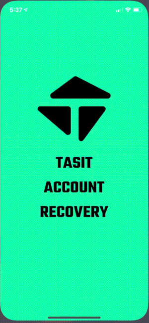

# account recovery app

This app shows how you can use contract-based account functionality from `tasit` to set up account recovery for the user.

### Try it with Expo
Try the app out without downloading it:

[expo.io/@tasit/account-recovery](https://expo.io/@tasit/account-recovery)

### Download the native app
##### iOS
[Sign up as a beta tester](https://testflight.apple.com/join/nBR0C6Cr)

##### Android
[Sign up as a beta tester](https://play.google.com/apps/testing/io.tasit.accountrecovery)

<!-- TODO: Add a signup link for a TestFlight beta -->

### App video
_~11 seconds long_

