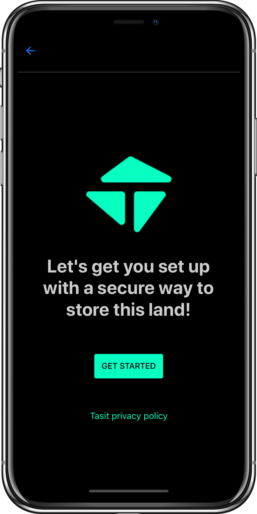
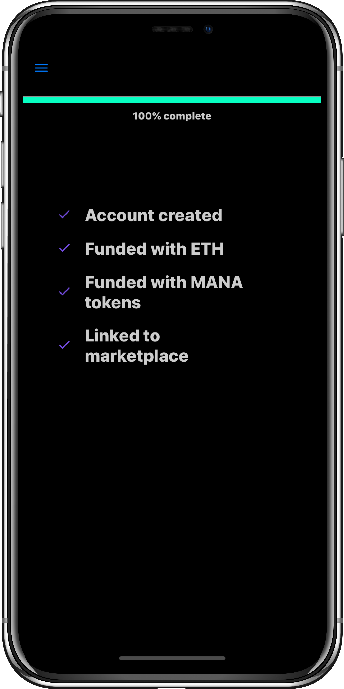

# Decentraland by Tasit

This folder is the home for the Decentraland by Tasit app.

You can use this app to buy parcels of Decentraland land from a standalone native mobile app.

The Decentraland app is also serving as our first demo app for using the Tasit SDK. It shows off how easy it is to build a standalone native mobile app for Ethereum NFTs using the Tasit SDK.

The app is built using React Native, Expo, React Navigation, Prettier, Babel, and the Tasit SDK.

### Getting started

```
git clone https://github.com/tasitlabs/tasit-apps.git
cd tasit
cd decentraland
npm i
npm start
```

### Screenshots

<div align="left">
  
  
  
</div>

<div align="left">
  
  
  
</div>

### More info

[More info here!](https://github.com/tasitlabs/tasit)
